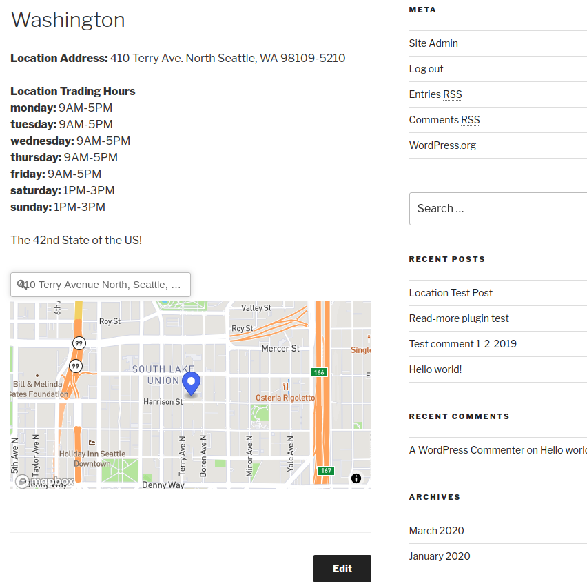

# Wordpress Location Plugin

## Author and Credits:
Author: Kevin Chen

Original Progammer for Wordpress Location Plugin: Simon Codrington 

Link to the article: https://www.sitepoint.com/real-world-example-wordpress-plugin-development

Link to plugin code: https://github.com/simonrcodrington/Introduction-to-WordPress-Plugins---Location-Plugin

Link to mapbox: https://www.mapbox.com

##Purpose:

To present my own ability to work with and add to other people's code as well as implement features in a way that is aesthetically pleasing.


##How to implement:

Log on to your Wordpress Admin page and on the menu on the side, click on Plugins.

Click on Add New below Plugins and then click on Upload Plugins next to the Add Plugins logo at the top.

Click Choose File and locate the zip file of the code then click Install Now

You should see a Location option in the Wordpress Admin menu on the side.

If you are running Wordpress on a personal server, make sure that you have FTP set up and the proper permissions to add or edit plugins.

##Code added:

Code was added inside wp_simple_location_plugin.php in class wp_simple_location in the function prepend_location_meta_to_content($content)

Specifically inside $html that is added at line 231 to line 287 where mapbox-gl and geocoder are set up. 

##What should be seen:

If implementation is set up correctly-one should see, below the contents of the initial location post, a geocoder search bar and below it a mapbox that should display the location of the address if one is presented. 

Let us use Amazon's headquarters as an input example. 

```
410 Terry Ave. North
Seattle, WA
98109-5210
```

If the plugin works as expected, you should see this:


